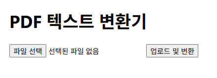
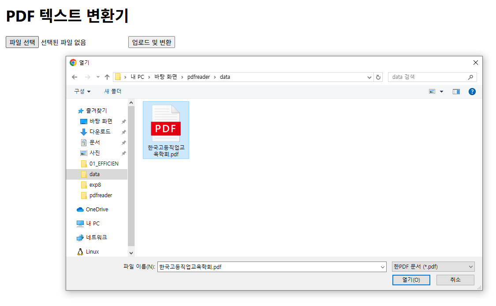

# 📄PDF to Text with OCR


### 미리보기



* 간단하게 파일 선택, 업로드 및 변환 버튼만 있습니다.

---



* 본인 기기에서 파일을 선택합니다.

---


* 파일 선택 후 업로드 및 변환 버튼을 누릅니다.

---


* 기다리면 변환된 텍스트를 받아옵니다.


### 폴더 구조

```bash
pdf-to-text-app/
 ├── back/               # FastAPI 백엔드
 │   ├── main.py
 │   ├── pdftotext.py
 │   └── requirements.txt
 ├── front/              # React 프론트엔드
 │   ├── package.json
 │   └── src/
 │       └── App.js 등
 └── README.md           # 사용설명서
 	 assets/
```


## 설치 및 실행 방법

### 1. 백엔드(FastAPI)

#### 사전준비

- Python 3.10 ~ 3.12 권장
- 'Tesseract-OCR' 설치 (윈도우 기준) https://github.com/UB-Mannheim/tesseract/wiki
  - 설치 경로 예시: `C:/Program Files/Tesseract-OCR/tesseract.exe` << 알아놔야함
  - 언어팩 `kor.traineddata` 포함 여부 확인 (`tessdata` 폴더에)
  - https://drpepper3.tistory.com/17 참고하여 환경변수 설정


#### 설치 및 실행 순서

```cmd
# 1. 저장소 클론
git clone https://github.com/bangthgh/pdfreader.git
cd pdfreader/back

# 2. 가상환경 생성 및 활성화 (선택)
# python -m venv venv
# venv\Scripts\activate  # Windows
# source venv/bin/activate  # macOS/Linux
# conda create -n env_name python=3.10~3.12 # conda

# 3. 의존성 설치
pip install -r requirements.txt

# 4. back/pdftotext.py << 7번째 줄
# pytesseract.pytesseract.tesseract_cmd = r'C:/Program Files/Tesseract-OCR/tesseract.exe'
# 뒤에 경로 본인 tesseract.exe 경로로 변경

# 5. 실행
uvicorn main:app --reload

# 기본 주소 : http://localhost:8000
```


### 2. 프론트엔드(React)

#### 설치 및 실행 순서

```cmd
cd ../front

# 1. Node.js 설치 (필요시)
# https://nodejs.org

# 2. package.json 설치
npm install

# 3. 실행
npm start

# 기본 주소 : http://localhost:3000
```

